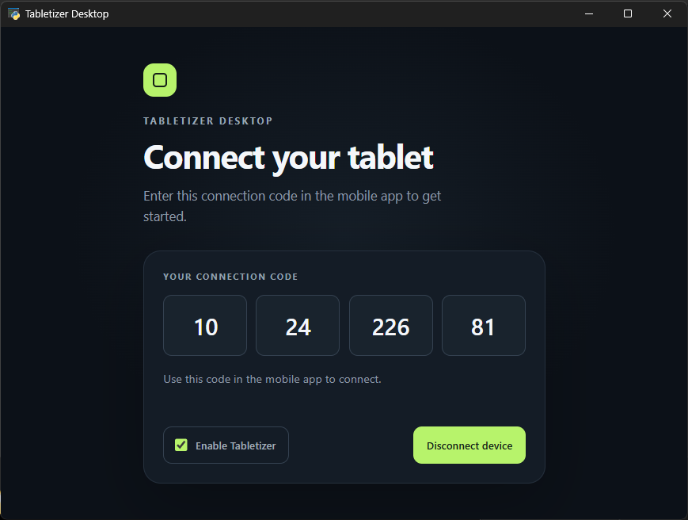
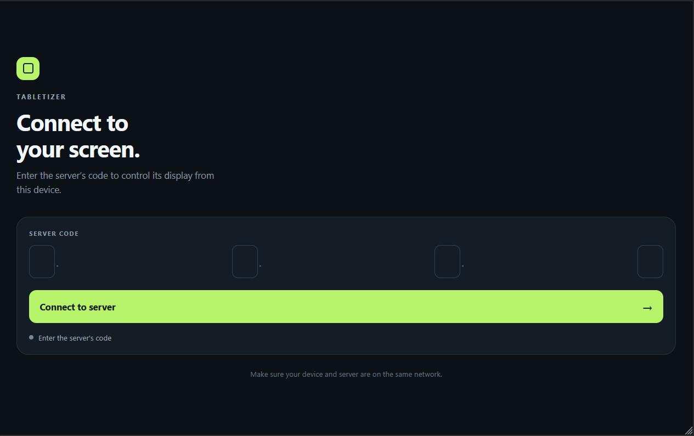
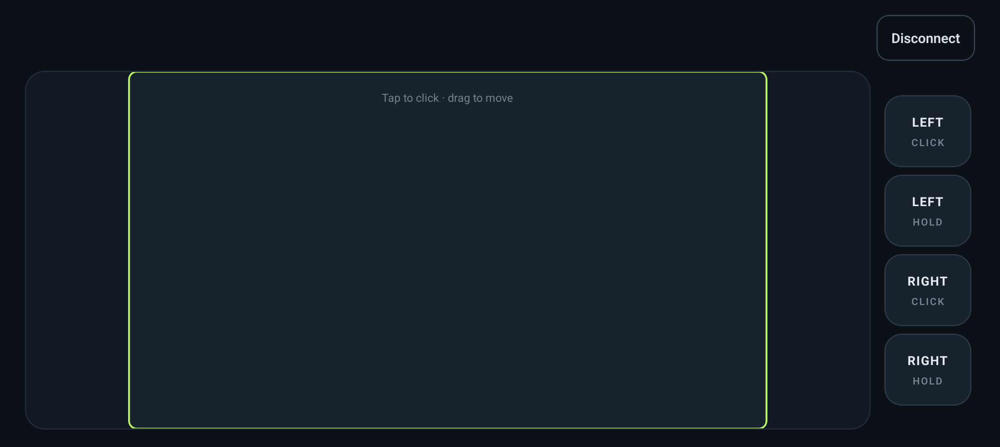

# Tabletizer

> **AI notice:** AI was used to make the CSS prettier in both the desktop and mobile apps, revise this README, and help write the GitHub Actions build workflows.

> **Git notice:** This remake started in a local development environment which means the initial file changes were committed as a whole.

This new Tabletizer project is a desktop and mobile remake of the original Tabletizer project. I have been developing it for some weeks in a local environment. It pairs a desktop host with a mobile remote touchpad, with a cleaner, more maintainable foundation, bug fixes, and improved features.

## Features

- **Desktop host for Windows, macOS, and Linux** — uses host's IP address as a code and accepts a mobile connection over WebSockets.
- **Mobile remote for Android** — connect by entering the desktop's "code" (IP address).
- **Touch-to-mouse controls** — tap to click, drag to move the pointer, and use dedicated left and right click controls.
- **Mouse-button holds** — toggle either mouse button down and release it when needed.
- **Connection controls and status** — see the connection state, disconnect a device, or disable incoming connections from the desktop.
- **Landscape remote controls** — the mobile remote switches to landscape when connected and restores the previous orientation when disconnected.

## Screenshots

### Desktop app



### Mobile connection screen



### Mobile control screen



## Project structure

```text
tabletizer-desktop/   Python desktop host and web interface
tabletizer-mobile/    Expo / React Native mobile app
.github/workflows/    Desktop and mobile build workflows
```

## Run locally

### Desktop

From `tabletizer-desktop`, install the Python dependencies and start the host:

```bash
python -m pip install -r requirements.txt
python main.py
```

The desktop app displays the address to enter in the mobile app. Both devices need to be on the same network.

The GitHub Actions workflow builds native executables for Windows, macOS, and Linux. To package the desktop app manually, run `build.sh` in a Bash environment with Python and the required system dependencies installed. 

### Mobile

From `tabletizer-mobile`, install the npm dependencies and start Expo:

```bash
npm install
npm run start
```

Use the Expo development tooling to open the app on an Android device.

## Build artifacts

The workflows in `.github/workflows/` can be started manually, run for relevant pushes and pull requests, and run when a GitHub release is published. Release builds are attached to that release:

- **Desktop:** Windows, macOS, and Linux executables.
- **Mobile:** Android release APK.
